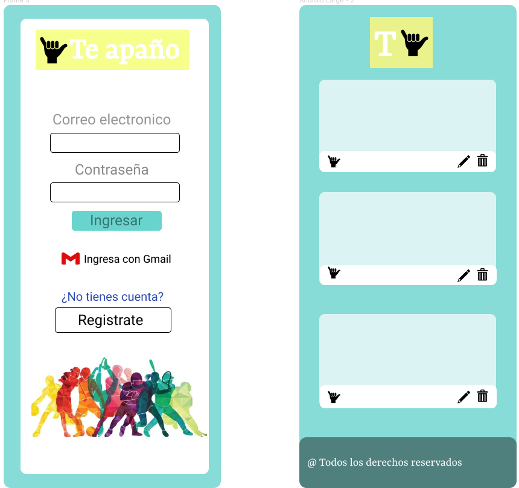
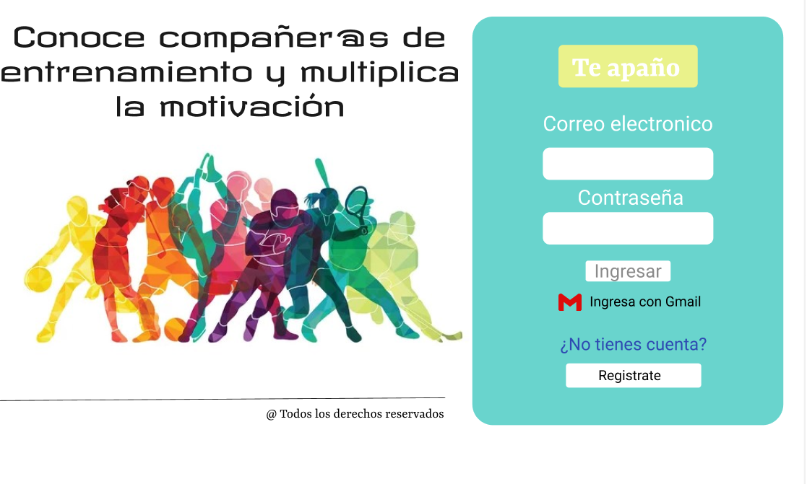

### Resumen del Proyecto

Te Apaño! es una red social orientada a personas que que entrenan constante mente o quieran empezar, pero les falta una compañia para motivarse. En base a nuestra investigación, detectamos que existe un gran numero de personas que no entrenan por que no les gusta entrenar solas, por lo que quisimos crear esta plataforma que permite compartir tips, dudas y que exista una red de contactor con el resto de personas que buscan un partner. Para esto solo debes registrarte o ingresar con tu cuenta de google y podrás dejar una publicacion para conocer gente.

###  Realizacion del Proyecto
Investigación de usuario

para determinar a nuestro público objetivo realizamos un formulario de preguntas con alternativas,con el cual definimos,siguiente perfil de usuario:

   * la mayoria se motiva entrenando acompañada.
   * les gustaria encontrar un partner para entrenar 
   * los colores brillantes los motivan.
   * el rango de edad va de los 25 a 35 años

### Historias de Usuario

Para elegir adecuadamente las características principales que debía tener nuestra red social según nuestro público objetivo, definimos las siguientes historias de usuario:

### Historia de Usuario: 1
Yo como usuario nuevo quiero registrarme para ingresar a la red social, o ingresar con mi cuenta de google.

### Historia de Usuario: 2
Yo como usuario ya registrado quiero ingresar.

### Historia de Usuario: 3
Yo como Usuario quiero crear, editar, borrar y "likear" publicaciones.

Estas historias de usuario las organizamos de forma colaborativa mediante trello. 

Realizamos un prototipo de baja fidelidad y un prototipo de alta fidelidad para el diseño de cada historia de usuario:

 
### falta imagen alta fidelidad

Verificamos que nuestra aplicacion, realizando test de usabilidad, nos dieron feedback en funciones, mensajes, diseño, lo cual nos ayudo a corregir nuestro codigo. Ayudandonos a mejorar.

 
